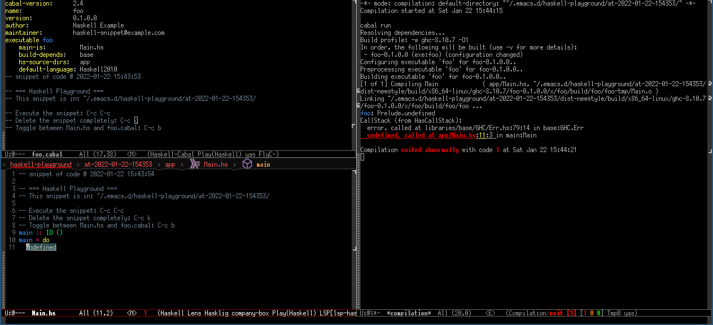

<!-- *- mode:markdown;mode:orgtbl;fill-column:99 -* -->
# haskell-playground

GNU/Emacs mode that setup local playground for code snippets in Haskell language.

This program was ported from [rust-playground](https://github.com/grafov/rust-playground).
rust-playground is a port of [go-playground](https://github.com/grafov/go-playground) adapted for Rust environment.

## Sample Image


## Usage

### Quick start

1. From any mode run `M-x haskell-playground` for start a new playground buffer filled with basic
   template for the package with main function (see the picture above).
1. Add your code then press `C-cC-c` (it bound to `haskell-playground-exec` command). It will save,
   compile and exec the snippet code.
1. When you played enough with this snippet just run `M-x haskell-playground-rm`. It will remove the
   current snippet with its directory and all files.

### List of interactive functions

<!---
#+ORGTBL: SEND keys orgtbl-to-gfm
| Function name                                      | Binding  | Description                                                         |
|----------------------------------------------------+----------+---------------------------------------------------------------------|
| `haskell-playground`                               |          | Create a new playground buffer with basic template for the package. |
| `haskell-playground-exec`                          | `C-cC-c` | Save, compile and run the code of the snippet.                      |
| `haskell-playground-rm`                            | `C-ck`   | Remove the snippet with its directory with all files.               |
| `haskell-playground-switch-between-cabal-and-main` | `C-cb`   | Swap the current buffer between cabal and main.                     |
-->
<!--- BEGIN RECEIVE ORGTBL keys -->
| Function name | Binding | Description |
|---|---|---|
| `haskell-playground` |  | Create a new playground buffer with basic template for the package. |
| `haskell-playground-exec` | `C-cC-c` | Save, compile and run the code of the snippet. |
| `haskell-playground-rm` | `C-ck` | Remove the snippet with its directory with all files. |
| `haskell-playground-switch-between-cabal-and-main` | `C-cb` | Swap the current buffer between cabal and main. |
<!--- END RECEIVE ORGTBL keys -->

## Customization

* Run `M-x customize-group [enter] haskell-playground`. You can change the initial template code, etc.

* If you want to automatically enable haskell-playground-mode for previously created haskell-playground files, write below code in your config file.
```
(add-hook 'haskell-mode-hook 'haskell-playground-enable)
```

